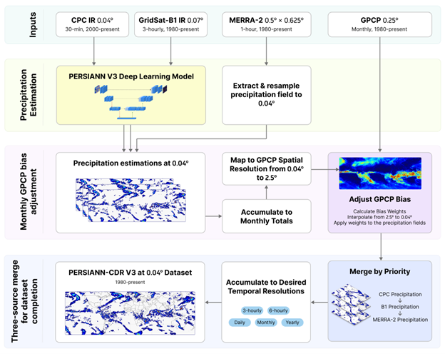

# PERSIANN-CDR V3

 <!-- Update or remove logo path as needed -->

**PERSIANN-CDR V3** is the latest version of the global Precipitation Estimation from Remotely Sensed Information using Artificial Neural Networks–Climate Data Record. It provides long-term, high-resolution satellite-based precipitation estimates, enabling climate research, hydrological modeling, and applications in weather and disaster monitoring.

---

## Key Features

- **Coverage:** Global (60°N–60°S)
- **Spatial Resolution:** 0.04° (~4 km)
- **Temporal Resolution:** 3-hourly, daily, monthly
- **Data Period:** [Start Year]–Present
- **Format:** NetCDF, GeoTIFF

---

## Highlights

- Improved calibration and bias correction for enhanced climate analysis
- Compatible with hydrological and climate models
- Open-source tools and example scripts available

---

## Access the Data

- [Primary Data Portal](https://chrsdata.eng.uci.edu/)
- [HTTP Download ](https://persiann.eng.uci.edu/CHRSdata/PUnetCDR/)

---

## Quick Start

## Documentation

- [User Guide](docs/USER_GUIDE.md) <!-- Adjust path as needed -->
- [Citing PERSIANN-CDR V3](#citation)
- [FAQ & Support](docs/FAQ.md)

---

## Citation

If you use PERSIANN-CDR V3 in your research, please cite:

> Nguyen, P., Dao, V., Ung, T., Jimenez Arellano, C., Hsu, K., Sorooshian, S., AghaKouchak, A., Huffman, G. J., & Ralph, F. M. PERSIANN-Unet: The first global satellite precipitation algorithm utilizing deep learning with infrared data. Accepted for publication in the Journal of Hydrometeorology.

(The full V3 citation will be available upon publication.)

---

## Contact & Support

For questions, dataset requests, or to report issues, please [open an issue](https://github.com/[your-org]/persiann-cdr-v3/issues) or email vudao1193@gmail.com.

---

## License

This dataset and accompanying code are licensed under the [CC BY 4.0 License](LICENSE).

---

**PERSIANN-CDR V3** is developed by the Center for Hydrometeorology and Remote Sensing (CHRS), University of California, Irvine.
